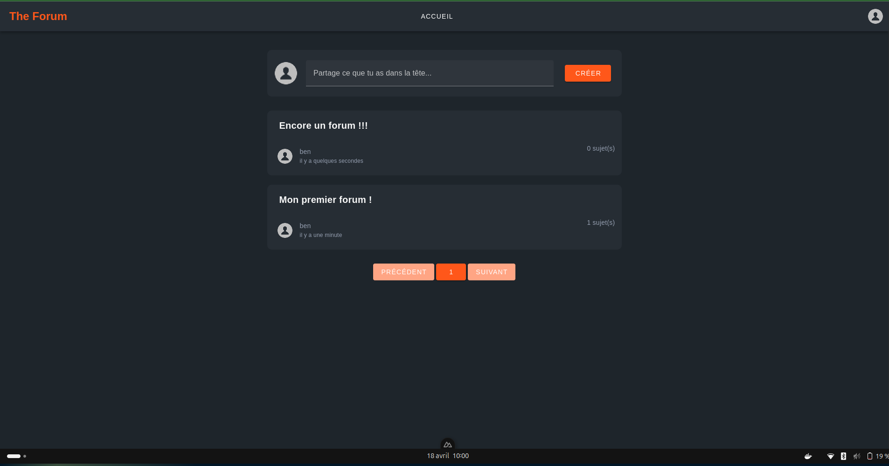
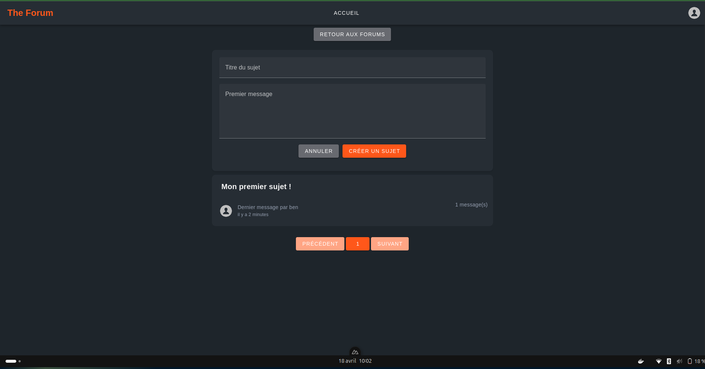
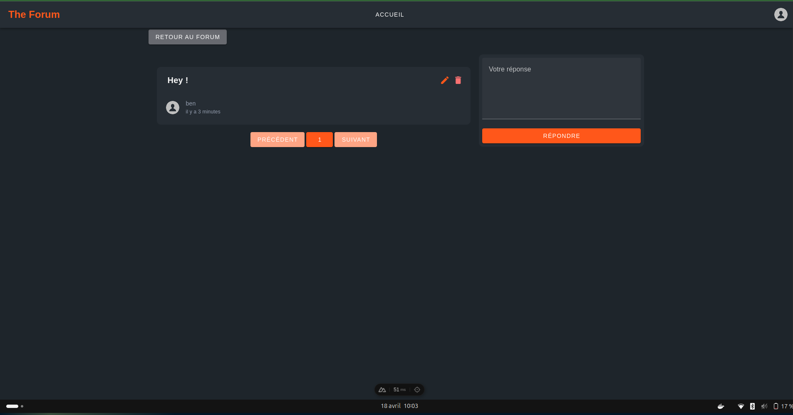
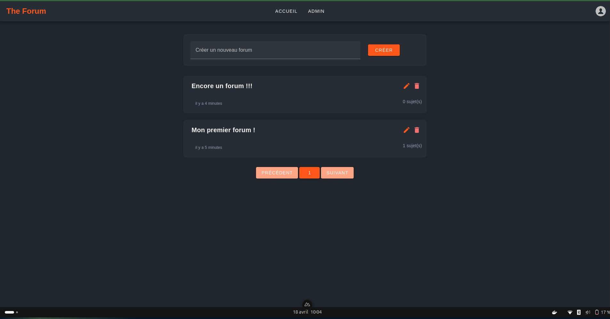

# Projet Nuxt.JS : Forum interactif

## Informations utiles
- Le .env est déjà configuré pour le projet. Pas besoin de le modifier.
- L'url de l'interface est `http://localhost:3001/`
- Un utilisateur admin est créer au premier lancement de l'application avec les identifiants suivants : nom d'utilisateur 'admin'; mot de passe 'admin'

## Installation
- Docker : 
  - `docker-compose up` pour lancer le conteneur

## Rapport
- Le rapport est disponible à la racine du projet sous le nom `rapport.pdf`.

## Interfaces
- Page d'accueil avec un forum créé par l'utilisateur ben

- Page des sujets d'un forum avec le formulaire de création de sujet ouvert

- Page des topics d'un sujet

- Page pour les admins avec la possibilité de modifier/supprimer/créer des forums

